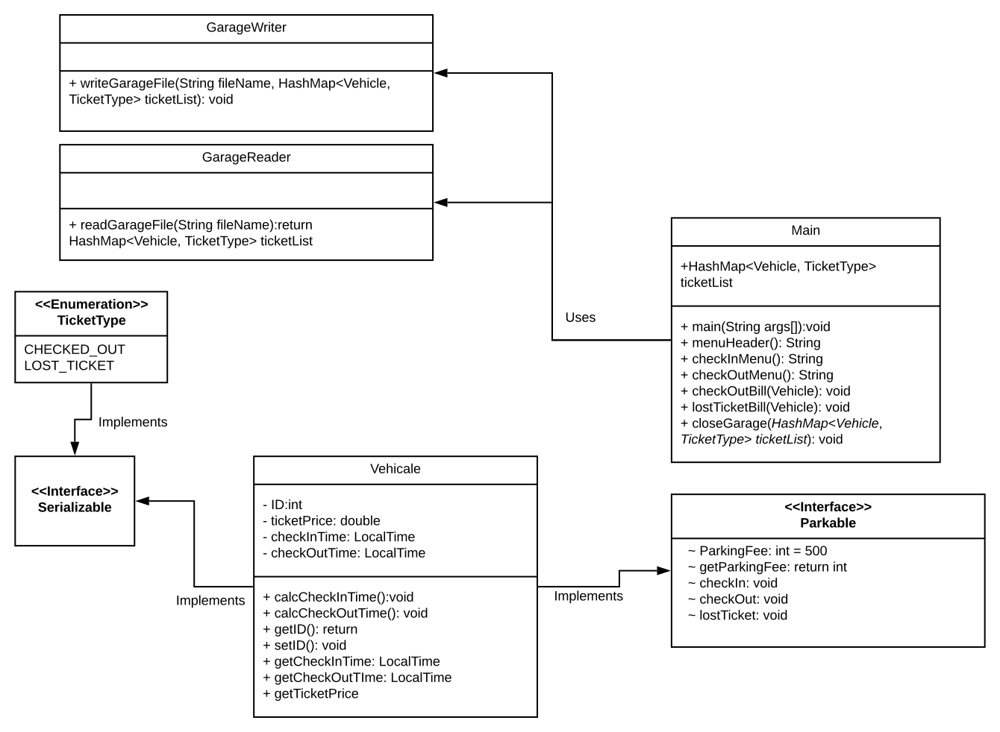

# mmulder4-u2-Parking-App
Automated Parking Garage made for my Advanced Java Class

### Collection Justification
I used the HashMap collection to store the tickets to make the search and revival of a vehicle was dependent on what type of ticket it had paired with it. 
Using a HashMap has made it easy to aggregate the tickets stored and the prices associated with them.
This aggregation is also similar with what would be done with a database you would have a table and then use functions to aggregate over the values in that table.
Below is a UML class diagram of this program.

